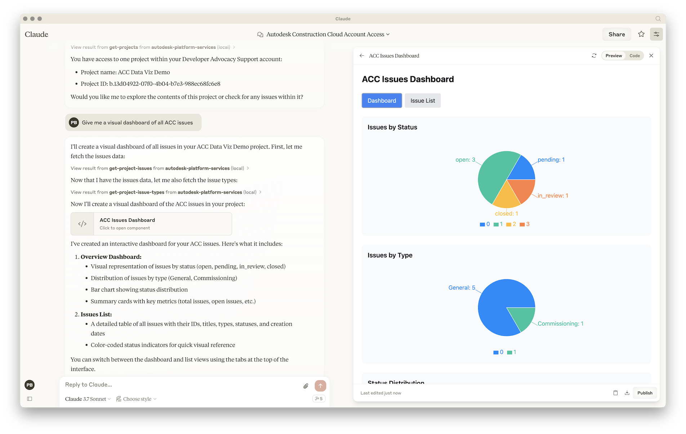

# Tutorial

This tutorial guides you through the process of implementing and testing a [Model Context Protocol (MCP)](https://modelcontextprotocol.io) server for [Autodesk Platform Services](https://aps.autodesk.com). By the end of the tutorial, you'll have a fully functioning MCP server that provides AI assistants with access to Autodesk Construction Cloud (ACC) data, including projects, folders, files, and issues.

> Tip: if you don't want to build the project from scratch, the complete implementation is available on GitHub: [https://github.com/autodesk-platform-services/aps-mcp-server-nodejs](https://github.com/autodesk-platform-services/aps-mcp-server-nodejs).

## What is the Model Context Protocol?

The [Model Context Protocol (MCP)](https://modelcontextprotocol.io) is an open protocol that standardizes how applications provide context to Large Language Models (LLMs). Think of MCP like a USB-C port for AI applications - it provides a standardized way to connect AI models to different data sources and tools.

## What You'll Build

Instead of building custom integrations for each AI assistant (Claude, ChatGPT, etc.), you can build one MCP server that works with any MCP-compatible client. This server can then provide the AI with access to:

- **Resources**: Files, database records, or any other data
- **Tools**: Functions the AI can call to perform actions
- **Prompts**: Pre-written templates to guide AI interactions

In this tutorial, you'll implement an MCP server that exposes the following tools to AI assistants:

1. **get-accounts** - Retrieve all ACC accounts accessible to your service account
2. **get-projects** - List all projects within a specific ACC account
3. **get-folder-contents** - Browse folders and files in an ACC project
4. **get-issues** - List all issues in an ACC project
5. **get-issue-types** - Retrieve available issue types for a project

These tools enable AI assistants to:

- Navigate your ACC project structure
- Analyze project data and generate insights
- Answer questions about issues, documents, and project status
- Create reports and dashboards from your ACC data

## Prerequisites

Before starting this tutorial, you should have:

- **Node.js** installed on your machine (version 16 or higher)
- An **APS application** (must be of type _Server-to-Server_)
  - See how to [create an app](https://aps.autodesk.com/en/docs/oauth/v2/tutorials/create-app)
- **Provisioned access to ACC** for your APS application
  - Follow the [provisioning guide](https://get-started.aps.autodesk.com/#provision-access-in-other-products)
- Basic knowledge of JavaScript/Node.js
- An AI client that supports MCP (we'll test with Claude Desktop and VS Code)

## Tutorial Structure

This tutorial is divided into four parts:

1. **Prerequisites** - Set up your Secure Service Account and prepare your environment
2. **Create MCP Server** - Build the MCP server using Node.js
3. **Create MCP Tools** - Implement the tools to interact with ACC data
4. **Integrate with MCP Clients** - Test your MCP server with AI clients like Claude Desktop and VS Code

## Additional Links

- [Code Repository](https://github.com/autodesk-platform-services/aps-mcp-server-nodejs)
- [Model Context Protocol Documentation](https://modelcontextprotocol.io)
- [Autodesk Platform Services](https://aps.autodesk.com)
- [Secure Service Account Documentation](https://aps.autodesk.com/en/docs/ssa/v1/developers_guide/overview/)
