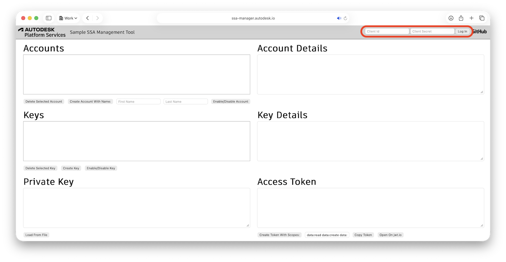
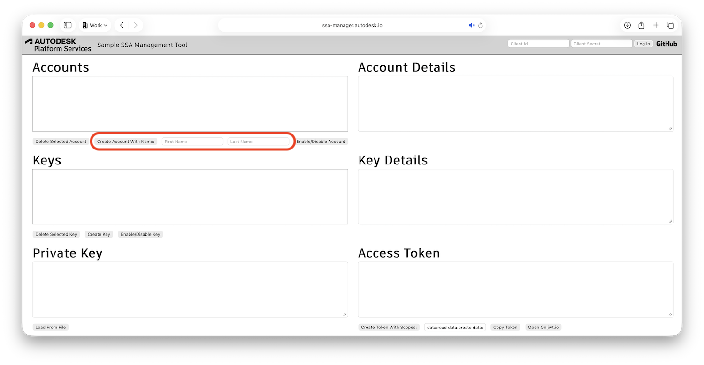
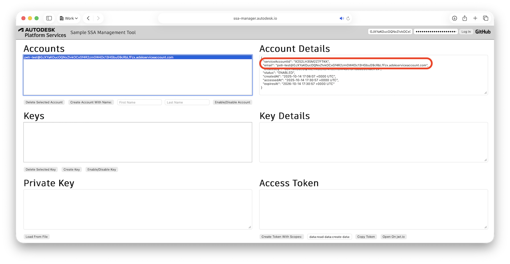
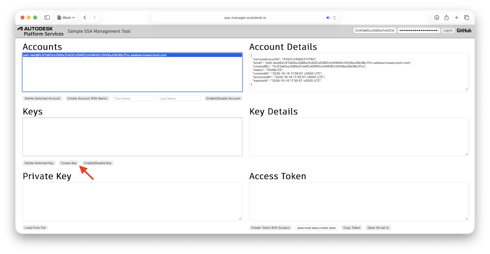
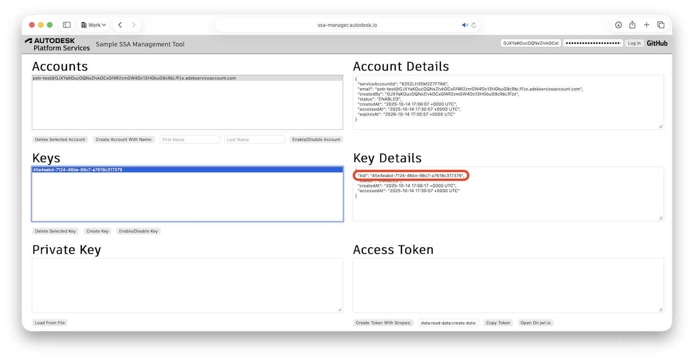
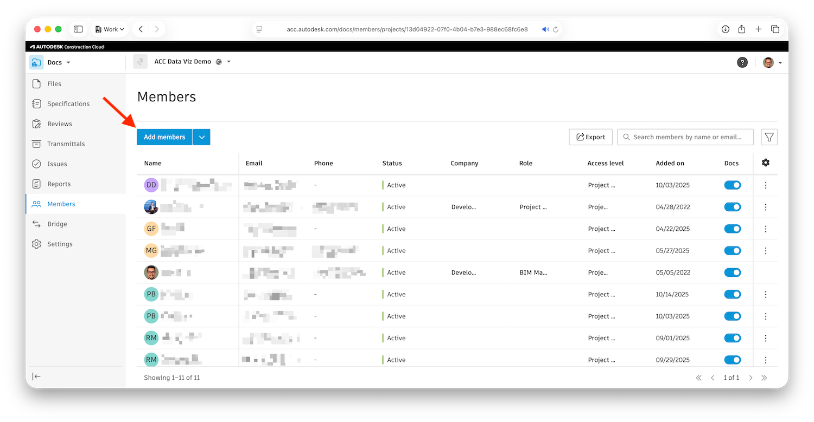
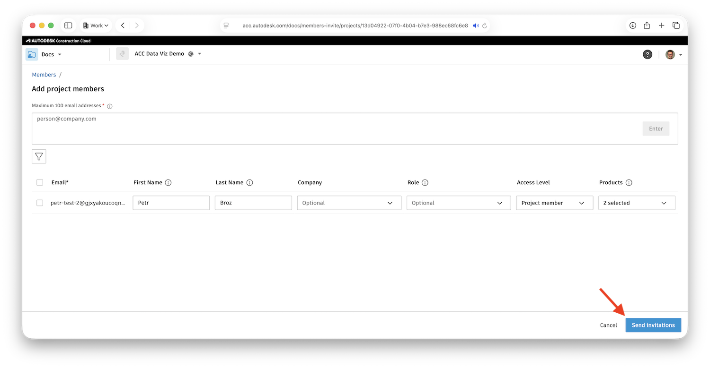
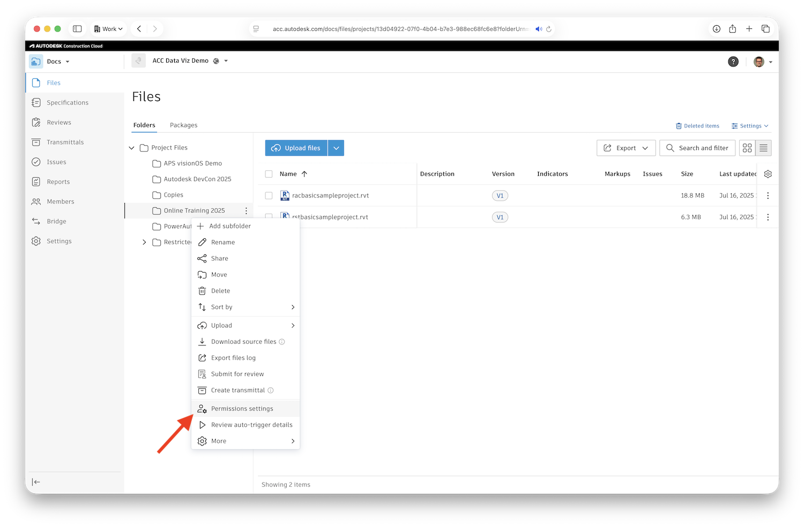
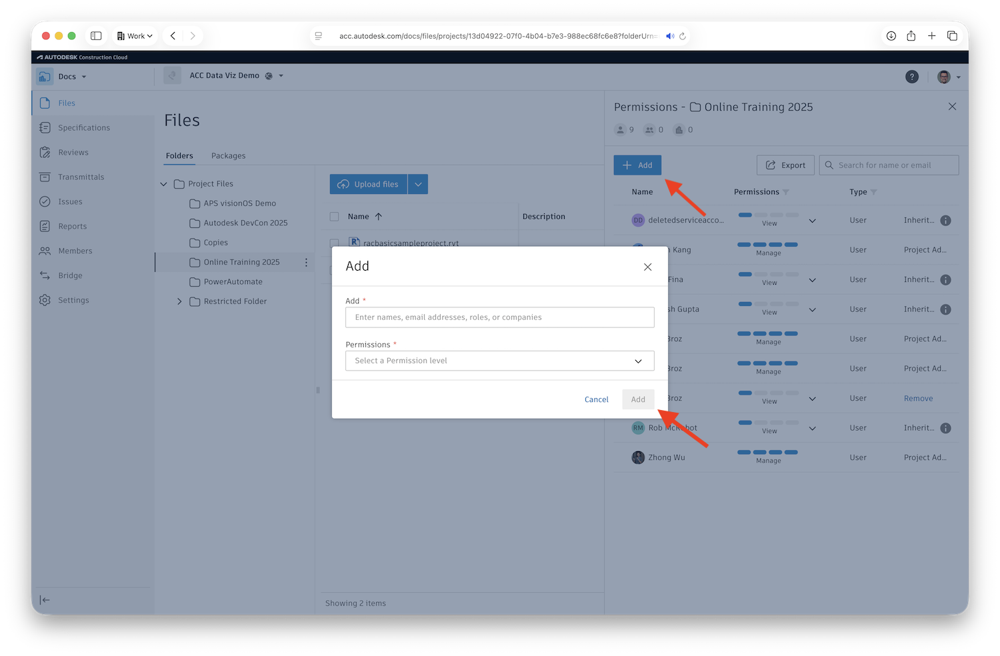

# Part 1: Prepare Service Account

In this part of the tutorial you will:

- Create a Secure Service Account for your MCP server
- Generate a private key for programmatic authentication
- Invite the service account to your ACC projects
- Gather the required credentials for server configuration

## Create a Secure Service Account

While you would typically implement the management of service accounts yourself using the [API](https://aps.autodesk.com/en/docs/ssa/v1/reference/http/), in this tutorial we'll use the [SSA Manager](https://ssa-manager.autodesk.io) demo application to quickly create a test account.

### Access SSA Manager

- Go to [https://ssa-manager.autodesk.io](https://ssa-manager.autodesk.io)
- Log in with your APS client ID and client secret
  - You can find these credentials under [https://aps.autodesk.com/myapps](https://aps.autodesk.com/myapps)

### Create a New Service Account

- Under the **Accounts** list, enter the first name and last name for your account
- Click the **Create Account With Name:** button

### Note Your Service Account Details

- Make sure the new account is selected in the **Accounts** list
- Under **Account Details**, make note of the `serviceAccountId` and `email` values as you'll need them later

## Generate a Private Key

Now you need to create a private key that your MCP server will use to authenticate as this service account.

### Create a New Private Key

- With your service account still selected in SSA Manager, click the **Create Key** button
- A `.pem` file with your newly generated private key will be automatically downloaded to your machine

> Warning: Treat this `.pem` file like a password. Anyone with access to it can authenticate as your service account.

### Note Your Key Details

- Make sure the new key is selected in the **Keys** list
- Under **Key Details**, make note of the `kid` (private key ID) value

> Note: The key ID uniquely identifies your private key and must be included in authentication requests.

## Invite Account to ACC

For your service account to have access to ACC projects, you need to invite it as a project member.

### Add New Member

- Go to one of your ACC projects
- Go to the **Members** section, and click **Add Members**

### Enter Member Details

- In the invitation dialog, enter the `email` of your service account, and click **Enter**
- Assign appropriate permissions (e.g., **Project Admin**, or more restricted roles)
- Click **Send invitations**

> Note: Unlike regular users, service accounts don't need to accept invitations. They have immediate access once invited.

### Configure Folder Permissions

- While still in your ACC project, go to the **Files** section
- Click the three dots next to one of your folders, and select **Permission settings**

- In the **Permissions** sidepanel, click **+ Add** to add a new permission
- In the **Add** dialog, select your service account user and pick the appropriate permission level
- Click the **Add** button to save this permission record

- Repeat this process for any other folders you want your MCP server to access

## Gather Your Credentials

Before moving to the next part, make sure you have collected all the required information:

- **APS_CLIENT_ID** - Your APS application client ID
- **APS_CLIENT_SECRET** - Your APS application client secret
- **SSA_ID** - Your service account ID
- **SSA_KEY_ID** - Your private key ID
- **SSA_KEY_PATH** - Full path to your downloaded .pem file, for example, `/Users/brozp/Downloads/8a4ee790-3378-44f3-bbab-5acb35ec35ce.pem`
