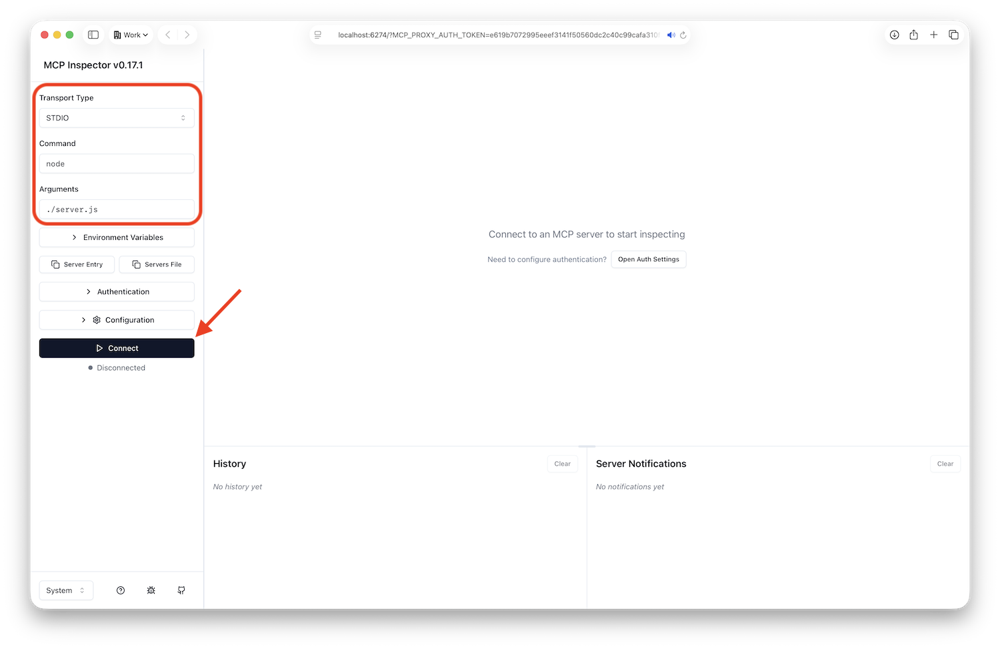
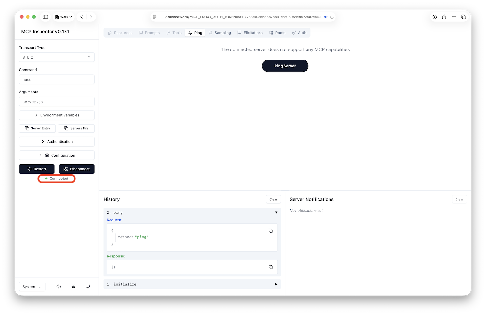

# Part 2: Create MCP Server

In this part of the tutorial you will:

- Create a new Node.js project
- Install required dependencies
- Implement configuration management
- Build the authentication layer
- Set up an MCP server
- Verify the implementation

## Create Node.js Project

Let's start by creating a new Node.js project.

### Prerequisites

Make sure you have Node.js version 16 or higher by running the following command in your terminal:

```bash
node --version
```

If you need to install Node.js, download it from [nodejs.org](https://nodejs.org).

### Initialize Node.js Project

Create a new folder for your project with a `package.json` file with the following content:

```json
{
  "name": "aps-mcp-server-nodejs",
  "version": "0.0.1",
  "type": "module",
  "private": true,
  "scripts": {
    "inspect": "mcp-inspector node ./server.js"
  },
  "dependencies": {
    "@aps_sdk/construction-issues": "^1.1.0",
    "@aps_sdk/data-management": "^1.1.2",
    "@modelcontextprotocol/sdk": "^1.20.0",
    "dotenv": "^17.2.3",
    "jsonwebtoken": "^9.0.2",
    "zod": "^3.24.2"
  },
  "devDependencies": {
    "@modelcontextprotocol/inspector": "^0.17.1"
  }
}
```

Note the various dependencies:

- **@modelcontextprotocol/sdk** - Core MCP protocol implementation
- **@aps_sdk/data-management** - APS Data Management API client
- **@aps_sdk/construction-issues** - ACC Issues API client
- **dotenv** - Environment variable management
- **jsonwebtoken** - JWT token generation for SSA authentication
- **zod** - Schema validation
- **@modelcontextprotocol/inspector** - Development tool for testing MCP servers

Next, navigate to your project folder in terminal, and install these dependencies:

```bash
npm install
```

### Create .gitignore

Create a `.gitignore` file to prevent committing sensitive data to [git](https://git-scm.com):

```bash
node_modules/
*.env
*.pem
```

This ensures your credentials and private keys stay secure.

## Implement Configuration Management

Next, let's create a configuration module to load and validate environment variables.

### Create Environment File

Create a `.env` file in the project directory, and add your credentials:

```bash
APS_CLIENT_ID="your-client-id-here"
APS_CLIENT_SECRET="your-client-secret-here"
SSA_ID="your-service-account-id"
SSA_KEY_ID="your-key-id"
SSA_KEY_PATH="/absolute/path/to/your-key.pem"
```

> Replace the placeholders with your actual values collected in [Part 1](../part1-service-account/index.md).

### Create Configuration Module

Create a `config.js` file in your project directory with the following code:

```javascript
import path from "node:path";
import url from "node:url";
import dotenv from "dotenv";

const __filename = url.fileURLToPath(import.meta.url);
const __dirname = path.dirname(__filename);
dotenv.config({ path: path.resolve(__dirname, ".env"), quiet: true });
const { APS_CLIENT_ID, APS_CLIENT_SECRET, SSA_ID, SSA_KEY_ID, SSA_KEY_PATH } = process.env;
if (!APS_CLIENT_ID || !APS_CLIENT_SECRET || !SSA_ID || !SSA_KEY_ID || !SSA_KEY_PATH) {
    console.error("Missing one or more required environment variables: APS_CLIENT_ID, APS_CLIENT_SECRET, SSA_ID, SSA_KEY_ID, SSA_KEY_PATH");
    process.exit(1);
}

export {
    APS_CLIENT_ID,
    APS_CLIENT_SECRET,
    SSA_ID,
    SSA_KEY_ID,
    SSA_KEY_PATH
}
```

This module:

- Loads environment variables from `.env`
- Validates all required credentials are present
- Exits with an error if any credentials are missing
- Exports configuration for use by other modules

## Build Shared Logic

Next, let's implement the shared logic for MCP tools that we will define in [Part 3](../part3-create-tools/).

### Create Common Utilities

Create a `utils.js` file in the root folder with the following content:

```javascript
import fs from "node:fs/promises";
import jwt from "jsonwebtoken";
import { DataManagementClient } from "@aps_sdk/data-management";
import { IssuesClient } from "@aps_sdk/construction-issues";
import { APS_CLIENT_ID, APS_CLIENT_SECRET, SSA_ID, SSA_KEY_ID, SSA_KEY_PATH } from "./config.js";

const TOKEN_ENDPOINT = "https://developer.api.autodesk.com/authentication/v2/token";

class ServiceAccountAuthenticationProvider {
    constructor(scopes) {
        this._accessToken = null;
        this._expiresAt = 0;
        this._scopes = scopes;
    }

    async getAccessToken() {
        if (!this._accessToken || this._expiresAt < Date.now()) {
            const assertion = await this._createAssertion(this._scopes);
            const { access_token, expires_in } = await this._exchangeAccessToken(assertion);
            this._accessToken = access_token;
            this._expiresAt = Date.now() + expires_in * 1000;
        }
        return this._accessToken;
    }

    async _createAssertion(scopes) {
        const expiresAt = Math.floor(Date.now() / 1000) + 300;
        const payload = { iss: APS_CLIENT_ID, sub: SSA_ID, aud: TOKEN_ENDPOINT, exp: expiresAt, scope: scopes };
        const privateKey = await fs.readFile(SSA_KEY_PATH, "utf-8");
        const options = {
            algorithm: "RS256",
            header: { alg: "RS256", kid: SSA_KEY_ID },
            noTimestamp: true
        };
        return jwt.sign(payload, privateKey, options);
    }

    async _exchangeAccessToken(assertion) {
        const headers = {
            "Accept": "application/json",
            "Authorization": `Basic ${Buffer.from(`${APS_CLIENT_ID}:${APS_CLIENT_SECRET}`).toString("base64")}`,
            "Content-Type": "application/x-www-form-urlencoded"
        };
        const body = new URLSearchParams({ grant_type: "urn:ietf:params:oauth:grant-type:jwt-bearer", assertion });
        const response = await fetch(TOKEN_ENDPOINT, { method: "POST", headers, body });
        if (!response.ok) {
            throw new Error(`Could not generate access token: ${await response.text()}`);
        }
        return response.json();
    }
}

const serviceAccountAuthenticationProvider = new ServiceAccountAuthenticationProvider(["data:read"]);
export const dataManagementClient = new DataManagementClient({ authenticationProvider: serviceAccountAuthenticationProvider });
export const issuesClient = new IssuesClient({ authenticationProvider: serviceAccountAuthenticationProvider });
```

This module:

- Creates JWT tokens using your service account credentials
- Exchanges JWT for an access token
- Exports authenticated API clients for APS services

### Create Tool Index

Create a `tools` folder in the root directory, and inside it create an empty `index.js`. Later, we will export all our MCP tools from this file so that we can easily register them in the MCP server.

## Setup MCP Server

Now let's setup the MCP server itself.

### Create Server File

Create `server.js` in the root directory:

```javascript
import { McpServer } from "@modelcontextprotocol/sdk/server/mcp.js";
import { StdioServerTransport } from "@modelcontextprotocol/sdk/server/stdio.js";
import * as tools from "./tools/index.js";

const server = new McpServer({ name: "aps-mcp-server-nodejs", version: "0.0.1" });
for (const tool of Object.values(tools)) {
    server.tool(tool.title, tool.description, tool.schema, tool.callback);
}

try {
    await server.connect(new StdioServerTransport());
} catch (err) {
    console.error("Server error:", err);
}
```

This code:

- Creates an MCP server instance
- Iterates through all exported tools and registers them
- Connects to stdio transport for communication with MCP clients

## Try it out

Before we start implementing individual MCP tools, let's make sure that our server runs as expected.

### Start MCP Inspector

Open the terminal in your project folder, and run the following command to download and run the [MCP Inspector](https://modelcontextprotocol.io/docs/tools/inspector):

```bash
npx @modelcontextprotocol/inspector
```

This will start an MCP Inspector server locally, and automatically open it in the browser.

> Tip: If the browser does not open automatically, the URL will be printed in the terminal, so just copy-paste it into your browser.

### Connect to MCP Server

On the MCP Inspector webpage, configure your connection parameters as follows:

- **Transport Type**: `STDIO`
- **Command**: `node`
- **Arguments**: `server.js`

After that, click the **Connect** button.



The status under the **Connect** button should show a small green circle followed by **Connected**, and the main page should contain a message saying **The connected server does not support any MCP capabilities**. This is expected - we have not implemented any capabilities in our MCP server yet, but we know we can connect to it.




-----------------

## Create Your First MCP Tool

Let's implement the `get-accounts` tool to list ACC accounts.

### Step 1: Create Get Accounts Tool

Create `tools/get-accounts.js`:

```javascript
import { dataManagementClient } from "./common.js";

export const getAccounts = {
  title: "get-accounts",
  description: `
    Retrieves all Autodesk Construction Cloud (ACC) accounts accessible 
    to the configured service account. Returns the list of accounts 
    with their IDs and names.
  `,
  schema: {},  // No parameters required
  callback: async () => {
    // Call APS API to get hubs (accounts)
    const hubs = await dataManagementClient.getHubs();
    
    // Format response for MCP
    return {
      content: (hubs.data || []).map((hub) => ({
        type: "text",
        text: JSON.stringify({
          id: hub.id,
          name: hub.attributes.name
        })
      }))
    };
  }
};
```

### Understanding the Tool Structure

Each MCP tool has four key components:

1. **title** - The tool name that MCP clients will use to invoke it
2. **description** - Explains what the tool does (helps AI understand when to use it)
3. **schema** - Defines input parameters using JSON Schema (empty for this tool)
4. **callback** - The async function that executes when the tool is called

### Step 2: Create Tool Index

Create `tools/index.js` to export all tools:

```javascript
export { getAccounts } from "./get-accounts.js";
```

We'll add more tools later, but this gets us started.

## Implement Additional Tools

Let's add a few more essential tools.

### Get Projects Tool

Create `tools/get-projects.js`:

```javascript
import { dataManagementClient } from "./common.js";

export const getProjects = {
  title: "get-projects",
  description: `
    Retrieves all projects within a specified Autodesk Construction Cloud account.
    Requires an accountId parameter.
  `,
  schema: {
    accountId: {
      type: "string",
      description: "The account ID (hub ID) to retrieve projects from"
    }
  },
  callback: async ({ accountId }) => {
    const projects = await dataManagementClient.getHubProjects(accountId);
    
    return {
      content: (projects.data || []).map((project) => ({
        type: "text",
        text: JSON.stringify({
          id: project.id,
          name: project.attributes.name
        })
      }))
    };
  }
};
```

### Get Issues Tool

Create `tools/get-issues.js`:

```javascript
import { issuesClient } from "./common.js";

export const getIssues = {
  title: "get-issues",
  description: `
    Retrieves all issues within an Autodesk Construction Cloud project.
    Requires a projectId parameter.
  `,
  schema: {
    projectId: {
      type: "string",
      description: "The ACC project ID to retrieve issues from"
    }
  },
  callback: async ({ projectId }) => {
    const issues = await issuesClient.getIssues(
      projectId.replace("b.", ""),
      { limit: 100 }
    );
    
    return {
      content: (issues.results || []).map((issue) => ({
        type: "text",
        text: JSON.stringify({
          id: issue.id,
          title: issue.title,
          status: issue.status
        })
      }))
    };
  }
};
```

### Update Tool Index

Update `tools/index.js` to export all tools:

```javascript
export { getAccounts } from "./get-accounts.js";
export { getProjects } from "./get-projects.js";
export { getIssues } from "./get-issues.js";
```

## Set Up the Main Server

Now let's create the main server file that brings everything together.

### Step 1: Create Server File

Create `server.js` in the root directory:

```javascript
import { McpServer } from "@modelcontextprotocol/sdk/server/mcp.js";
import { StdioServerTransport } from "@modelcontextprotocol/sdk/server/stdio.js";
import * as tools from "./tools/index.js";

// Create MCP server instance
const server = new McpServer({ 
  name: "aps-mcp-server", 
  version: "1.0.0" 
});

// Register all tools
for (const tool of Object.values(tools)) {
  server.tool(
    tool.title,
    tool.description,
    tool.schema,
    tool.callback
  );
}

// Connect to stdio transport
try {
  await server.connect(new StdioServerTransport());
  console.error("APS MCP Server running");
} catch (err) {
  console.error("Server error:", err);
  process.exit(1);
}
```

This server:
- Creates an MCP server instance
- Iterates through all exported tools and registers them
- Connects to stdio transport for communication with MCP clients
- Handles errors gracefully

### Step 2: Understand the Flow

Here's how the MCP server works:

1. **Client connects** to the server via stdio
2. **Client requests** available tools
3. **Server responds** with tool definitions (title, description, schema)
4. **Client invokes** a tool with parameters
5. **Server executes** the tool's callback function
6. **Server returns** formatted results to the client

## Verify the Implementation

Let's verify everything is working correctly.

### Step 1: Check Project Structure

Your project should now look like this:

### Step 1: Check Project Structure

Your project should now look like this:

```
aps-mcp-server/
├── package.json
├── config.js
├── server.js
├── .env
├── .gitignore
└── tools/
    ├── index.js
    ├── common.js
    ├── get-accounts.js
    ├── get-projects.js
    └── get-issues.js
```

### Step 2: Test Configuration Loading

Verify your configuration loads correctly:

```bash
node -e "import('./config.js').then(() => console.log('✅ Configuration loaded'))"
```

If successful, you'll see `✅ Configuration loaded`. If there are errors, check your `.env` file.

### Step 3: Test Server Startup

Try starting the server:

```bash
npm start
```

You should see: `APS MCP Server running`

Press Ctrl+C to stop it - we'll test it properly with MCP Inspector in the next part.

## What You've Built

Congratulations! You've just built a fully functional MCP server from scratch. Let's review what each component does:

### Core Components

**config.js**
- Loads environment variables
- Validates credentials
- Exports configuration

**tools/common.js**
- Handles SSA authentication
- Creates JWT tokens
- Provides authenticated APS API clients

**server.js**
- Creates MCP server instance
- Registers all tools
- Handles client connections

### MCP Tools

**get-accounts**
- Lists all ACC accounts
- No parameters required
- Returns account IDs and names

**get-projects**
- Lists projects in an account
- Requires: `accountId`
- Returns project IDs and names

**get-issues**
- Lists issues in a project
- Requires: `projectId`
- Returns issue ID, title, and status

## Extend Your Server (Optional)

Want to add more tools? Here's how:

### Add Get Folder Contents Tool

Create `tools/get-folder-contents.js`:

```javascript
import { dataManagementClient } from "./common.js";

export const getFolderContents = {
  title: "get-folder-contents",
  description: `
    Retrieves the contents of a folder within an ACC project.
    If no folderId is provided, returns top-level folders.
  `,
  schema: {
    accountId: {
      type: "string",
      description: "The account ID (hub ID)"
    },
    projectId: {
      type: "string",
      description: "The project ID"
    },
    folderId: {
      type: "string",
      description: "The folder ID (optional)",
      optional: true
    }
  },
  callback: async ({ accountId, projectId, folderId }) => {
    let contents;
    
    if (folderId) {
      // Get folder contents
      contents = await dataManagementClient.getFolderContents(
        projectId,
        folderId
      );
    } else {
      // Get top-level folders
      contents = await dataManagementClient.getProjectTopFolders(
        accountId,
        projectId
      );
    }
    
    return {
      content: (contents.data || []).map((item) => ({
        type: "text",
        text: JSON.stringify({
          id: item.id,
          name: item.attributes.displayName || item.attributes.name,
          type: item.type === "folders" ? "folder" : "item"
        })
      }))
    };
  }
};
```

Then add to `tools/index.js`:

```javascript
export { getAccounts } from "./get-accounts.js";
export { getProjects } from "./get-projects.js";
export { getIssues } from "./get-issues.js";
export { getFolderContents } from "./get-folder-contents.js";
```

The server will automatically register any tools exported from `tools/index.js`!

## Common Implementation Issues

### "Module not found" errors

**Problem**: Import errors when running the server

**Solutions**:
- Verify `"type": "module"` is in package.json
- Check all import paths are correct (case-sensitive)
- Ensure all dependencies are installed

### "Cannot find module" for config.js

**Problem**: Server can't find config.js

**Solutions**:
- Use correct relative path: `import { } from "./config.js"`
- Don't forget the `.js` extension in imports
- Verify the file exists in the right location

### Authentication fails

**Problem**: JWT or token errors

**Solutions**:
- Verify `.env` file has all 5 variables
- Check `SSA_KEY_PATH` points to correct .pem file
- Ensure SSA_KEY_ID matches the key file
- Verify service account exists in SSA Manager

### "scope" errors

**Problem**: "Insufficient scope" errors from APS API

**Solutions**:
- Check JWT payload includes correct scopes
- Verify service account has ACC project access
- Ensure you invited the service account to projects
