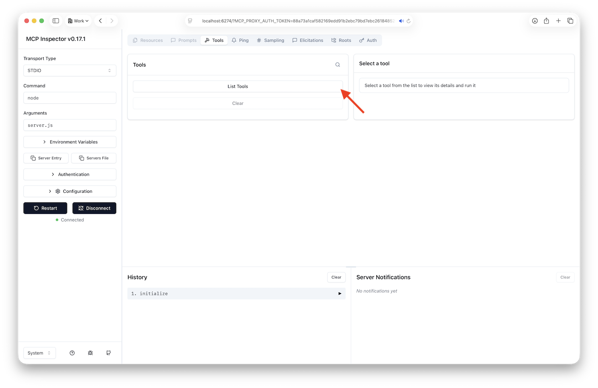
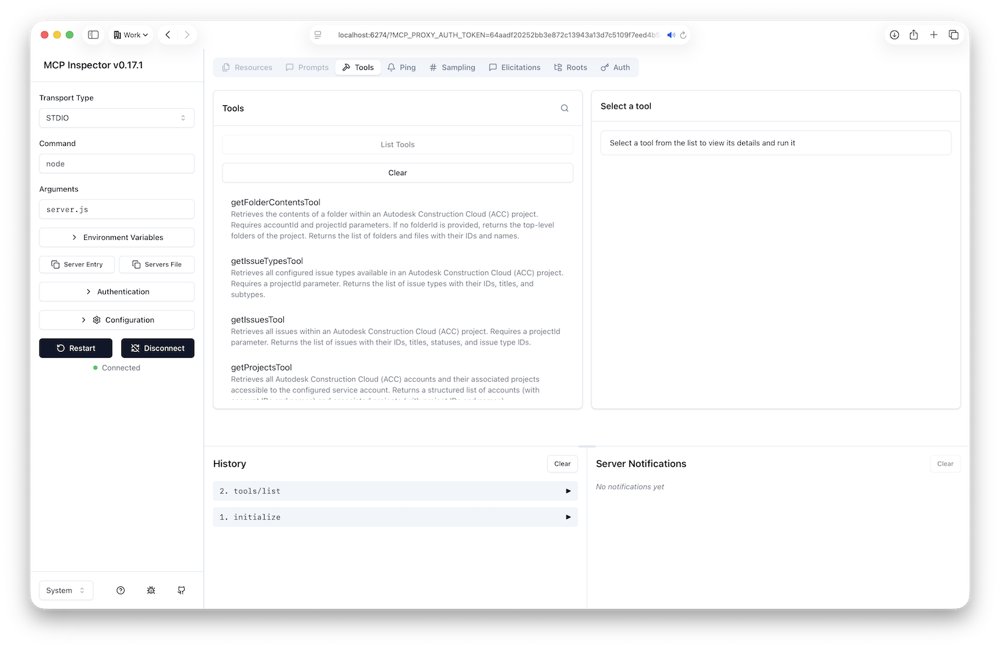
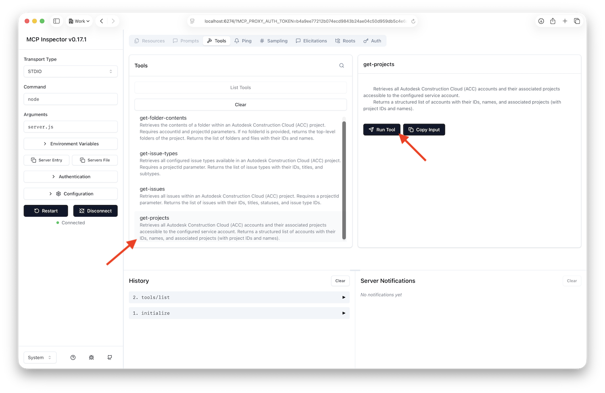
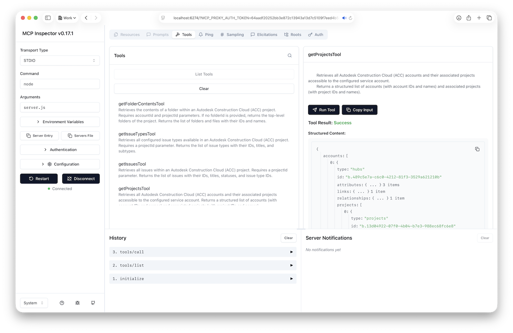

# Part 3: Create MCP Tools

In this part of the tutorial you will implement individual tools for our MCP server, and test them out.

## Get Accounts

The first tool we will implement is the **Get Accounts** tool. This tool will return a list of accounts that the authenticated user has access to.

### Implement Get Accounts Tool

Create `tools/get-accounts.js` with the following code:

```javascript
import { dataManagementClient } from "../utils.js";

export const getAccounts = {
    title: "get-accounts",
    description: `
        Retrieves all Autodesk Construction Cloud (ACC) accounts accessible to the configured service account.
        Returns the list of accounts with their IDs and names.
    `,
    schema: {},
    callback: async () => {
        const response = await dataManagementClient.getHubs();
        const hubs = response.data || [];
        return {
            content: hubs.map((hub) => ({
                type: "text",
                text: JSON.stringify({
                    id: hub.id,
                    name: hub.attributes.name
                })
            }))
        };
    }
};
```

### Add Get Accounts Tool to Index

Add the following line of code to `tools/index.js`:

```javascript
export { getAccounts } from "./get-accounts.js";
```

This will make sure that the tool is registered when the server starts.

## Get Projects

Next, we will implement the **Get Projects** tool. This tool will return a list of projects for a given account.

### Implement Get Projects Tool

Create `tools/get-projects.js` with the following code:

```javascript
import { z } from "zod";
import { dataManagementClient } from "../utils.js";

export const getProjects = {
    title: "get-projects",
    description: `
        Retrieves all projects within a specified Autodesk Construction Cloud (ACC) account.
        Requires an accountId parameter. Returns project IDs and names that can be used to access
        project-specific data such as folders, documents, and issues.
    `,
    schema: {
        accountId: z.string().nonempty()
    },
    callback: async ({ accountId }) => {
        const response = await dataManagementClient.getHubProjects(accountId);
        const projects = response.data || [];
        return {
            content: projects.map((project) => ({
                type: "text",
                text: JSON.stringify({
                    id: project.id,
                    name: project.attributes.name
                })
            }))
        };
    }
};
```

### Add Get Projects Tool to Index

Add the following line of code to the end of `tools/index.js`:

```javascript
export { getProjects } from "./get-projects.js";
```

## Get Folder Contents

The next tool we will implement is the **Get Folder Contents** tool. This tool will return a list of items in a given folder.

### Implement Get Folder Contents Tool

Create `tools/get-folder-contents.js` with the following code:

```javascript
import { z } from "zod";
import { dataManagementClient } from "../utils.js";

export const getFolderContents = {
    title: "get-folder-contents",
    description: `
        Retrieves the contents of a folder within an Autodesk Construction Cloud (ACC) project.
        Requires accountId and projectId parameters. If no folderId is provided, returns the top-level folders of the project.
        Returns the list of folders and files with their IDs and names.
    `,
    schema: {
        accountId: z.string().nonempty(),
        projectId: z.string().nonempty(),
        folderId: z.string().optional()
    },
    callback: async ({ accountId, projectId, folderId }) => {
        const response = folderId
            ? await dataManagementClient.getFolderContents(projectId, folderId)
            : await dataManagementClient.getProjectTopFolders(accountId, projectId);
        const contents = response.data || [];
        return {
            content: contents.map((item) => ({
                type: "text",
                text: JSON.stringify({
                    id: item.id,
                    type: item.type,
                    name: item.attributes.displayName
                })
            }))
        };
    }
};
```

### Add Get Folder Contents Tool to Index

Add the following line of code to the end of `tools/index.js`:

```javascript
export { getFolderContents } from "./get-folder-contents.js";
```

## Get Issues

Next, we will implement the **Get Issues** tool. This tool will return a list of issues for a given project.

### Implement Get Issues Tool

Create `tools/get-issues.js` with the following code:

```javascript
import { z } from "zod";
import { issuesClient } from "../utils.js";

export const getIssues = {
    title: "get-issues",
    description: `
        Retrieves all issues within an Autodesk Construction Cloud (ACC) project. Requires a projectId parameter.
        Returns the list of issues with their IDs, titles, statuses, and issue type IDs.
    `,
    schema: {
        projectId: z.string().nonempty()
    },
    callback: async ({ projectId }) => {
        const response = await issuesClient.getIssues(projectId.replace("b.", ""));
        const issues = response.results || [];
        return {
            content: issues.map((issue) => ({
                type: "text",
                text: JSON.stringify({
                    id: issue.id,
                    title: issue.title,
                    status: issue.status,
                    description: issue.description,
                    issueTypeId: issue.issueTypeId,
                    issueSubtypeId: issue.issueSubtypeId
                })
            }))
        };
    }
};
```

### Add Get Issues Tool to Index

Add the following line of code to the end of `tools/index.js`:

```javascript
export { getIssues } from "./get-issues.js";
```

## Get Issue Types

Finally, we will implement the **Get Issue Types** tool. This tool will return a list of issue types for a given project.

### Implement Get Issue Types Tool

Create `tools/get-issue-types.js` with the following code:

```javascript
import { z } from "zod";
import { issuesClient } from "../utils.js";

export const getIssueTypes = {
    title: "get-issue-types",
    description: `
        Retrieves all configured issue types available in an Autodesk Construction Cloud (ACC) project.
        Requires a projectId parameter. Returns the list of issue types with their IDs, titles, and subtypes.
    `,
    schema: {
        projectId: z.string().nonempty()
    },
    callback: async ({ projectId }) => {
        const response = await issuesClient.getIssuesTypes(projectId.replace("b.", ""), { include: "subtypes"});
        const issueTypes = response.results || [];
        return {
            content: issueTypes.map((issueType) => ({
                type: "text",
                text: JSON.stringify({
                    id: issueType.id,
                    title: issueType.title,
                    subtypes: issueType.subtypes.map((subtype) => ({
                        id: subtype.id,
                        title: subtype.title
                    }))
                })
            }))
        };
    }
};
```

### Add Get Issue Types Tool to Index

Add the following line of code to the end of `tools/index.js`:

```javascript
export { getIssueTypes } from "./get-issue-types.js";
```

## Try it out

Now that we have implemented all the tools, let's test them out using the MCP Inspector.

### Start MCP Inspector

If you have closed the MCP Inspector, open the terminal in your project folder, and run the following command to download and run the [MCP Inspector](https://modelcontextprotocol.io/docs/tools/inspector):

```bash
npx @modelcontextprotocol/inspector
```

### Connect to MCP Server

On the MCP Inspector webpage, configure your connection parameters as follows:

- **Transport Type**: `STDIO`
- **Command**: `node`
- **Arguments**: `server.js`

After that, click the **Connect** button.

### List Tools

This time, we should be able to get a list of tools exposed by our MCP server, and invoke them directly from the MCP Inspector webpage. Click the **List tools** button to retrieve the complete list of tools available in our MCP server:



As a result, the UI should list tools such as `get-accounts`, `get-folder-contents`, `get-issue-types`, etc.



### Test Get Accounts Tool

Now, let's try the tool for listing ACC hubs that our service account has access to. Select the **get-accounts** tool, and click **Run**.



As a result, you should see a JSON with a list of IDs and names of ACC hubs that your application has access to.


