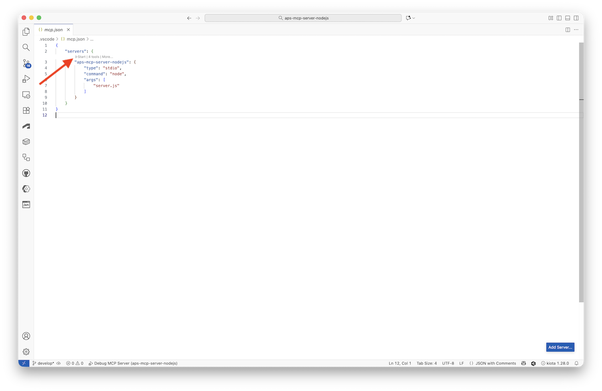
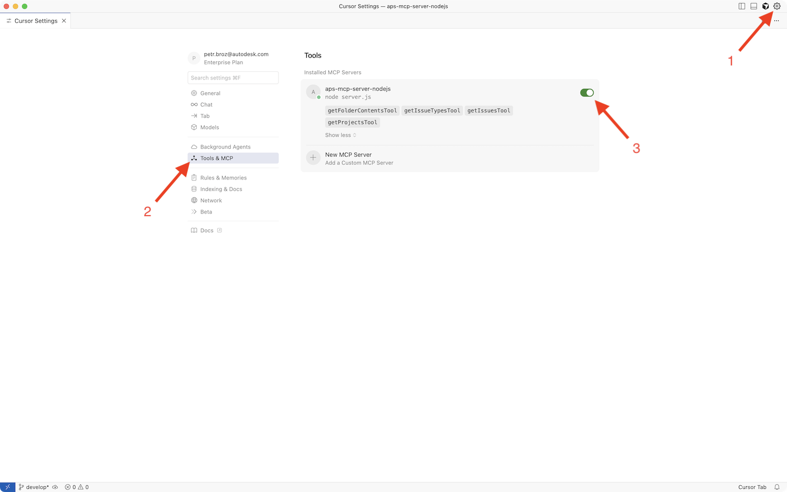
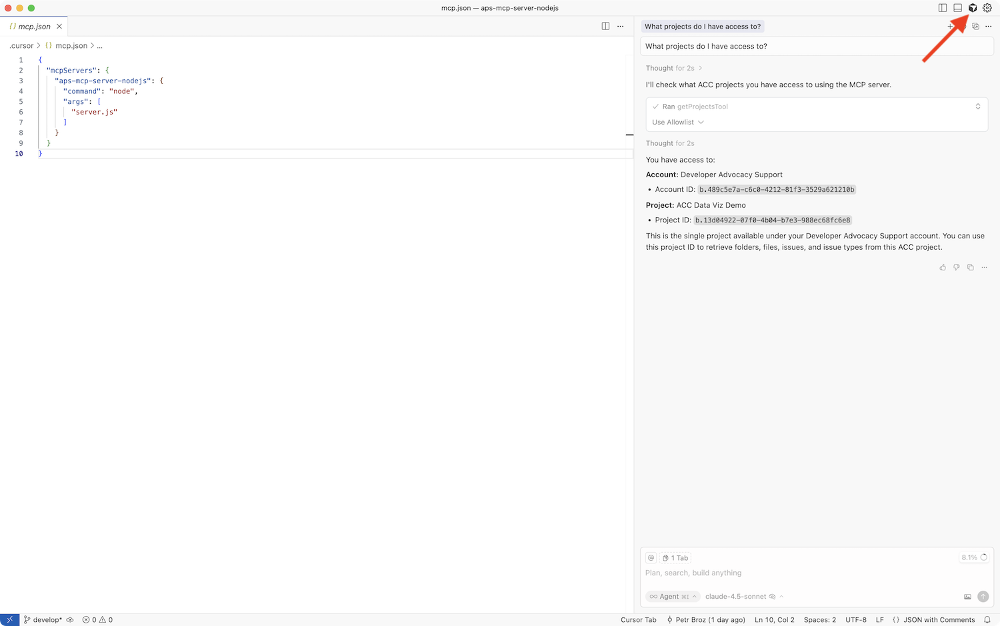
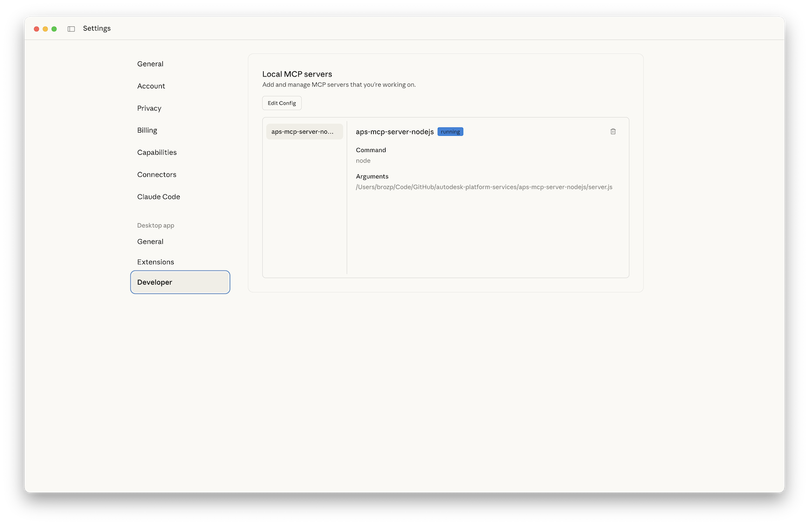

# Part 4: Integrate with MCP Clients

In this final part of the tutorial you will learn how to integrate your MCP server with various AI-powered development tools that support the Model Context Protocol.

We'll cover integration with:

- **Visual Studio Code (GitHub Copilot)** - Microsoft's AI pair programmer
- **Cursor** - AI-first code editor
- **Claude Desktop** - Anthropic's desktop chat application

## Visual Studio Code

GitHub Copilot in VS Code supports MCP servers, allowing you to extend Copilot's capabilities with custom tools and context.

### Configure MCP Server in Visual Studio Code

- Make sure you have [enabled MCP servers in Visual Studio Code](https://code.visualstudio.com/docs/copilot/chat/mcp-servers#_enable-mcp-support-in-vs-code)
- Create `.vscode/mcp.json` file in the root folder of your project, and add the following JSON to it:

```json
{
  "servers": {
    "aps-mcp-server-nodejs": {
      "type": "stdio",
      "command": "node",
      "args": [
        "server.js"
      ]
    }
  }
}
```

### Test MCP Server in Visual Studio Code

- Open the project folder in Visual Studio Code
- In the `.vscode/mcp.json` file, click the **Start** action right above the MCP server name



- Open GitHub Copilot Chat
  - Click the **Toggle Chat** icon next to the search bar at the top of the window, or
  - Press `Cmd+Shift+I` (macOS) or `Ctrl+Shift+I` (Windows/Linux)
- Try some of the [example prompts](#example-prompts) listed at the end of this page


## Cursor

Cursor is an AI-first code editor built on VS Code with enhanced AI capabilities and native MCP support.

### Configure MCP Server in Cursor

Cursor uses a similar configuration approach to VS Code but with its own settings file.

- Create `.cursor/mcp.json` file in your workspace, and add the following JSON to it:

```json
{
  "mcpServers": {
    "aps-mcp-server-nodejs": {
      "command": "node",
      "args": [
        "server.js"
      ]
    }
  }
}
```

### Test MCP Server in Cursor

- Open the root folder of this project in Cursor
- Go to **Cursor Settings** > **Tools & MCP**, and make sure that the `aps-mcp-server-nodejs` MCP server is enabled



- Open the **AI Pane**
- Try some of the [example prompts](#example-prompts) listed at the end of this page



## Claude Desktop

Claude Desktop is Anthropic's official desktop application for interacting with Claude AI, with built-in MCP support.

### Configure MCP Server in Claude Desktop

Claude Desktop uses a JSON configuration file to manage MCP servers. The location of the file depends on your operating system:

- **macOS:** `~/Library/Application Support/Claude/claude_desktop_config.json`
- **Windows:** `%APPDATA%\Claude\claude_desktop_config.json`
- **Linux:** `~/.config/Claude/claude_desktop_config.json`

If the file doesn't exist, create it. Add your MCP server configuration:

```json
{
  "mcpServers": {
    "aps-mcp-server-nodejs": {
      "command": "node",
      "args": [
        "/path/to/your/aps-mcp-server-nodejs/server.js"
      ]
    }
  },
  "isUsingBuiltInNodeForMcp": false
}
```

> **Important:** Use absolute path for the server script.

### Test MCP Server in Claude Desktop

- Open Claude Desktop
- Go to **Settings** > **Developer**, and make sure that the MCP server is registered and running



- Try some of the [example prompts](#example-prompts) listed at the end of this page


## Example Prompts

Here are some example prompts you can try:

```text
What projects do I have access to?
```

```text
List all *.rvt files in the project
```

```text
I've discovered a hole in the ground on a construction site. What kind of issue should I report?
```
